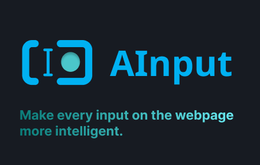

# AInput - Chrome Extension

A powerful Chrome extension that enhances text input on any web page using Google's Gemini 2.0 Flash AI model. Features include grammar fixing and translation to multiple languages.



## Features

✨ **Fix Grammar** - Automatically fix grammar and spelling errors in your text  
🌐 **Translate** - Translate text to your preferred language  
⚡ **Real-time Processing** - Instant AI-powered text enhancement  
🎯 **Universal** - Works on any text input or textarea on the web  
🔒 **Privacy-focused** - Uses your own Gemini API key

## Prerequisites

* [Node.js + npm](https://nodejs.org/) (Current Version)
* [Google Gemini API Key](https://aistudio.google.com/app/apikey) (Free)

## Technology Stack

* TypeScript
* React 18
* Webpack 5
* Google Gemini 2.5 Flash API
* Chrome Extension Manifest V3

## Installation

### 1. Clone and Build

```bash
# Install dependencies
npm install

# Build the extension
npm run build
```

### 2. Load Extension in Chrome

1. Open Chrome and navigate to `chrome://extensions/`
2. Enable "Developer mode" (toggle in top-right corner)
3. Click "Load unpacked"
4. Select the `dist` directory from this project

### 3. Configure API Key

1. Click the extension icon in Chrome toolbar
2. Go to "Options" or right-click the extension and select "Options"
3. Get your free API key from [Google AI Studio](https://aistudio.google.com/app/apikey)
4. Enter your API key
5. Select your preferred translation language
6. Click "Save Settings"

## Usage

1. Visit any webpage with text inputs or textareas
2. You'll see two buttons below each text field:
   - **Fix Grammar** (Green) - Corrects grammar and spelling
   - **Translate** (Blue) - Translates to your selected language
3. Type or paste your text
4. Click the desired button
5. The AI will process your text and replace it with the enhanced version

## Supported Languages for Translation

- Spanish
- French
- German
- Italian
- Portuguese
- Russian
- Japanese
- Korean
- Chinese (Simplified & Traditional)
- Arabic
- Hindi
- Dutch
- Polish
- Turkish
- Vietnamese
- Thai
- Indonesian

## Development

### Build in Watch Mode

```bash
npm run watch
```

Or in Visual Studio Code, press `Ctrl + Shift + B`

### Run Tests

```bash
npm test
```

### Code Formatting

```bash
npm run style
```

## Project Structure

```
├── public/              # Static files
│   ├── manifest.json   # Extension manifest
│   ├── options.html    # Settings page
│   └── popup.html      # Extension popup
├── src/                # Source files
│   ├── background.ts   # Background service worker (API calls)
│   ├── content_script.tsx  # Content script (button injection)
│   ├── options.tsx     # Settings page component
│   └── popup.tsx       # Popup component
├── dist/               # Built extension (load this in Chrome)
└── webpack/            # Webpack configuration
```

## How It Works

1. **Content Script** - Injects "Fix Grammar" and "Translate" buttons next to all text inputs
2. **Background Worker** - Handles API calls to Google Gemini 2.0 Flash
3. **Chrome Storage** - Securely stores your API key and preferences
4. **React Components** - Modern UI with TypeScript for type safety

## API Rate Limits

The free tier of Gemini API includes:
- 15 requests per minute
- 1,500 requests per day
- 1 million tokens per minute

For most users, this is more than sufficient for daily use.

## Privacy & Security

- Your API key is stored locally in Chrome's sync storage
- All API calls are made directly from your browser to Google's servers
- No third-party servers or tracking
- Your text data is only sent to Google's Gemini API

## Troubleshooting

**Buttons not appearing?**
- Make sure the extension is enabled in `chrome://extensions/`
- Refresh the webpage after installing the extension

**API errors?**
- Verify your API key is correct in the extension options
- Check that your API key has not exceeded rate limits
- Ensure you have an internet connection

**Text not updating?**
- Check the browser console for error messages
- Try disabling other extensions that might interfere with text inputs

## License

MIT

## Contributing

Contributions are welcome! Please feel free to submit a Pull Request.

## Support

If you encounter any issues or have questions, please open an issue on the GitHub repository.
